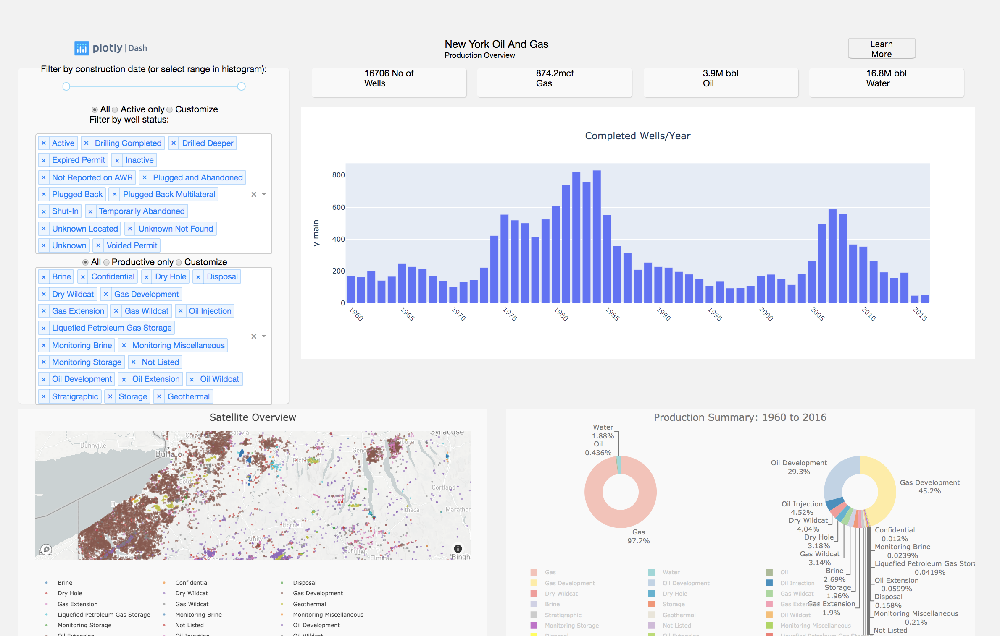

## Like Oil and Gas
#### Yet another version of the Dash *New York Oil and Gas* Gallery app, that simplifies the callback boilerplate, and determines the visual layout using only css.



#### To Run:
To run directly from a jupyter notebook, run all the cells in the notebook  ```dashoilgas/dash_oil_gas.ipynb```

To run as a python .py module from a bash command line, run: 
```
cd dashoilgas/dashoilgas
python3 dash_oil_gas.py
```


#### How it works:
1. Simple css grid layouts
    * The workbook creates a Dash.app using Dash.html and Dash.dcc components.  The css file assets/oilgas.css defines the layout of the page by assigning ```display:grid``` css definitions at both the html id and html class level. 
    * Below, you can see the basic layout, which consists of 3 grid rows.  Each row has several columns, which might themselves have nested rows and columns.


2. The ```DashLink``` class defines callbacks that link the components:
    * The ```DashLink``` class provides methods for defining any kind of callback between any set of Dash html or dcc components.  You will not find separate ```@app.callback``` definitions in the code.  There is a single reusable callback closure that allows you to create call backs without copying and pasting Dash's callback boilerplate.  
    * See the ```DashLink``` constructor and the ```DashLink.callback()``` method.


## Grid Layout of Page
___
### row 1: Title
* dash_logo
* title
* dash_learn_more
___
### row 2: Filters and Year Graph
* column 1: **Filters**
    * filter_construct_date
    * filter_well_status
    * filter_well_type
* column 2: **Panels and Graph**
    * row 1: *Panels*
        * no_wells
        * mcf_gas
        * bbl_oil
        * bbl_water
    * row 2: *Graphs*
        * wells_per_year_graph
___
### row 3: Well satellite map and well type pie chart
* column 1: **Map and Graph**
    * satellite_map
    * prod_summary_graph
___
### bottom_div
___

## To run as a stand-alone web app:

#### A version of this notebook has been converted to a .py module using:
```!jupyter nbconvert --to script dash_oil_gas.ipynb```